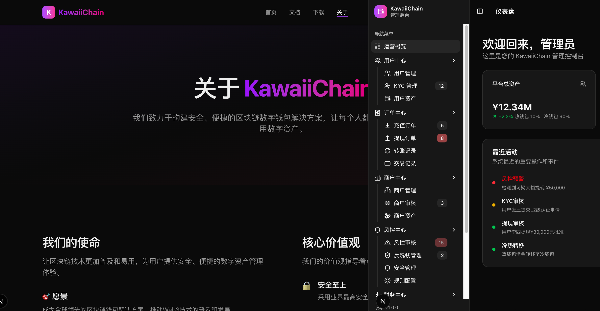

# KawaiiChain Wallet 后端服务

基于Spring Cloud微服务架构的数字钱包后端系统。

## 🏗️ 项目架构

### 微服务模块

| 服务名 | 端口   | 描述 | 技术栈 |
|--------|------|------|-------|
| kawaii-gateway | 8080 | API网关 | Spring Cloud Gateway |
| kawaii-user | 8081 | 用户服务 | Spring Boot + MyBatis-Plus |
| kawaii-core | 8082 | 钱包核心服务 | Spring Boot + Web3j |
| kawaii-payment | 8083 | 支付服务 | Spring Boot |
| kawaii-common | -    | 公共组件库 | Spring Boot Starter |
| kawaii-api | -    | API接口定义 | Feign Client |

### 技术栈

- **框架**: Spring Boot 3.x + Spring Cloud 2023.x
- **服务发现**: Nacos Discovery
- **配置中心**: Nacos Config
- **数据库**: PostgreSQL 17
- **缓存**: Redis 7.0
- **ORM**: MyBatis-Plus
- **服务调用**: OpenFeign
- **API网关**: Spring Cloud Gateway
- **文档**: SpringDoc OpenAPI 3

## 项目简介

**KawaiiChain Wallet** 是一个基于区块链技术的数字钱包项目，不仅提供传统的密钥管理功能，更是一个完整的支付解决方案。用户可以安全地管理数字资产，进行转账交易，并与合作商户进行便捷的支付结算。

## 核心特性

- 🔐 **安全密钥管理** - 支持创建、导入和安全存储用户私钥
- 💰 **多币种支持** - 支持主流数字货币的存储和交易
- 🔄 **转账功能** - 快速、安全的链上转账服务
- 🏪 **商户支付** - 与合作商户的无缝支付集成
- 📱 **移动优先** - 原生移动端体验
- 🌐 **Web支持** - 完整的Web端管理界面

## 功能截图示意



## 技术栈

| 组件 | 技术选型 | 说明      |
|------|----------|---------|
| 移动端 | Flutter | 跨平台原生应用 |
| 后端服务 | Java Spring Cloud | 微服务架构   |
| 官方网站 | Next.js | 产品宣传网站  |
| 管理后台 | Next.js | 运营管理界面  |
| 区块链 | Web3 集成 | 多链支持    |

## 📚 文档目录

- **[环境配置指南](docs/environment-setup.md)** - 完整的开发和部署环境配置
- **[API路由规范](docs/api-routes.md)** - 网关路由规则和API设计规范
- **[错误码管理](docs/error-codes.md)** - 统一错误码定义和使用规范
- **[安全配置](docs/security-config.md)** - JWT认证、权限控制和监控配置
- **[数据库设计](docs/database-design.md)** - 数据库架构和设计原则
- **[Nacos配置示例](docs/nacos-configs/)** - 各环境完整配置文件

## 🚀 快速开始

### 前置要求
- JDK 21+
- Maven 3.9+
- PostgreSQL 17
- Redis 7.0
- Nacos 3.0+

### 本地开发
```bash
# 1. 启动基础设施 (PostgreSQL, Redis, Nacos)
# 2. 配置Nacos命名空间和配置文件
# 3. 启动微服务
cd kawaii-gateway && mvn spring-boot:run
cd kawaii-user && mvn spring-boot:run
```

详细步骤请参考：**[环境配置指南](docs/environment-setup.md)**

## 🔗 相关项目

- **[kawaii-mobile](https://github.com/kawaiichainwallet/kawaii-mobile)** - 移动端应用
- **[kawaii-website](https://github.com/kawaiichainwallet/kawaii-website)** - 产品宣传网站
- **[kawaii-admin](https://github.com/kawaiichainwallet/kawaii-admin)** - 管理后台

## 📄 许可证

本项目采用 BSD 3-Clause License 许可证 - 查看 [LICENSE](LICENSE) 文件了解详情

## ⚠️ 免责声明

### 技术交流与教育目的

**KawaiiChain Wallet 是一个开源的技术研究和教育项目，仅供学习、研究和技术交流使用。**

### 重要声明

1. **纯技术项目**: 本项目仅作为区块链和数字钱包技术的研究与学习工具，不提供任何金融服务或投资建议。

2. **合规责任**: 使用者需自行了解并遵守所在国家和地区关于数字货币、区块链技术的相关法律法规。我们不对任何违法使用承担责任。

3. **地区限制**: 本项目可能在某些国家和地区不被允许使用。如果您所在的司法管辖区禁止或限制此类技术，请不要下载、安装或使用本软件。

4. **风险提示**:
    - 数字资产具有高风险性，价格波动剧烈
    - 私钥丢失可能导致资产永久损失
    - 区块链交易具有不可逆性
    - 智能合约可能存在未知漏洞

5. **无担保声明**: 本软件按"现状"提供，不提供任何明示或暗示的担保。开发团队不对使用本软件造成的任何损失承担责任。

6. **数据安全**: 虽然我们致力于提供安全的技术方案，但无法保证绝对的安全性。用户应当采取适当的安全措施保护自己的数字资产。

### 使用条件

使用本项目即表示您：
- 已阅读并理解上述免责声明
- 承诺仅将本项目用于合法的技术学习和研究目的
- 同意自行承担使用本项目的所有风险和责任
- 确认在您所在的司法管辖区使用本项目是合法的

---

📧 **联系方式**: kawaiichainwallet@gmail.com
